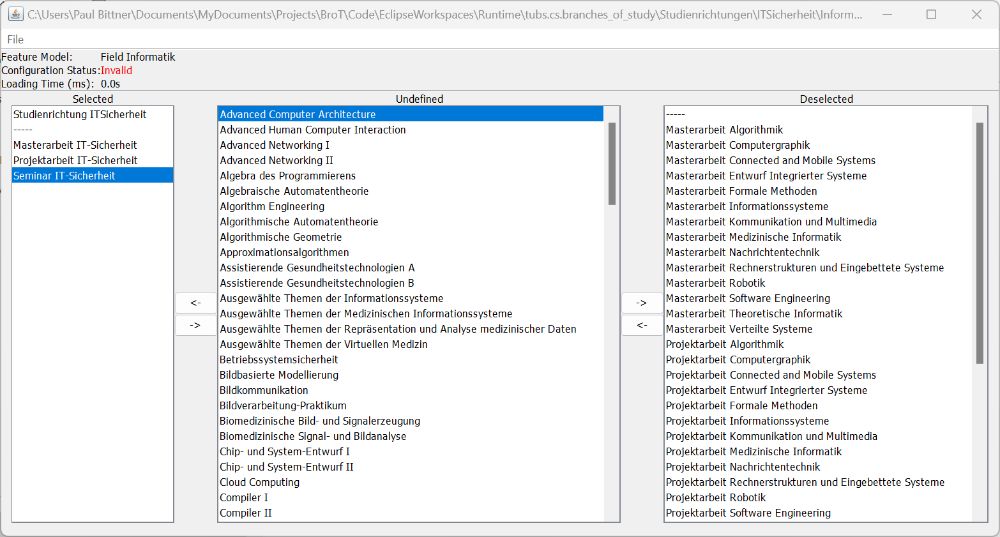

# SAT Encodings of the At-Most-k Constraint
## A Case Study on Configuring University Courses

[][preprint]

This repository contains code and evaluation data corresponding to:

> [Bittner P.M., Thüm T., Schaefer I.: _SAT Encodings of the At-Most-k Constraint: A Case Study on Configuring University Courses_. Software Engineering and Formal Methods (SEFM). 2019.][1]

> [Frisch, A.M., Giannaros, P.A.: _SAT Encodings of the At-Most-k Constraint. Some
Old, Some New, Some Fast, Some Slow_. Ninth International Workshop of
Constraint Modelling and Reformulation. 2010.][2]

[comment]: <> (Please cite as:)

### Tool

We provide a runnable jar file for testing our BRanch Of study Tool (Brot) at the top level of this repository.
The jar is built from the project `Code/EclipseWorkspaces/Development/Brot`.
Our tool takes [FeatureIDE][7] feature model files as input and allows creating configurations for them.
Opening the feature models of some branches may take a few minutes.

When running the jar, a graphical user interface will show up as shown in the screenshot above.
You may use the `File` button to open a feature model for configuration.
After loading a feature model, its features are shown in the center column. You may use the arrow buttons to move features from and to the lists of selected or deselected features, respectively.
BroT will then automatically select or deselect other features to satisfy the feature model's constraints.

As a possible input to our tool, you can find the feature model files for the [branches of study at TU Braunschweig][6] in `Code/EclipseWorkspaces/Runtime/tubs.cs.branches_of_study/Studienrichtungen`.
These are files we (1) compiled from our DSL as described in our paper, and (2) performed our evaluation on.
Beware: Opening the feature models in BroT or FeatureIDE may freeze the program because some of the models are very large.
To play around, we recommend the `IT-Sicherheit` model, which is one of the smalles and least-constrained branches of study.

In case you are interested in **reusing the SAT encodings in your own software project**, please have a look at our open-source [example project](https://github.com/SoftVarE-Group/BroTLibraryExample/tree/master).

### Code
The code is given in two [Eclipse][3] workspaces: `Runtime` and `Development`.

The [branches of study at TU Braunschweig][6] are given in the `Runtime` workspace together with
the feature models they were compiled to.
These are in german like the original specifications, but our DSL also supports english keywords.

The `Development` workspace contains the implementation of the at-most-k encodings, domain-specific language (DSL),
and compiler to feature models.
The encodings implementation can be found in the project `AtMostSATEncodings`.
Our DSL and compiler are in the project `tubs.cs.studienrichtung`, which is an Eclipse plugin project.
In order to run it, the [eclipse modelling framework][4] and [EMFText][5] are required.
The generated code for our abstract syntax is given in the `src-gen` subdirectory.
However, the concrete syntax has to be generated by running EMFText on our grammar file
`tubs.cs.studienrichtung\model\Studienrichtung.cs`. In Eclipse this can be done via the context menu.
The `GraphicalConfigurator` projects contains a simple configuration tool for feature models.
It can be used to configure the feature models, generated by our DSL compiler.

### Evaluation Data
We provide our data on evaluating the at-most-k encodings and feature models compiled from our DSL files, describing
the [branches of study at TU Braunschweig][6].
For each branch, csv files are given summarising the results for each encoding together with a general overview.

[1]: https://link.springer.com/chapter/10.1007%2F978-3-030-30446-1_7
[2]: http://www.cs.toronto.edu/~fbacchus/csc2512/at_most_k.pdf
[3]: https://www.eclipse.org/
[4]: https://www.eclipse.org/modeling/emf/
[5]: https://marketplace.eclipse.org/content/emftext
[6]: https://www.tu-braunschweig.de/informatik-msc/struktur/studienrichtungen
[7]: https://featureide.github.io/

[preprint]: https://github.com/SoftVarE-Group/Papers/raw/main/2019/2019-SEFM-Bittner.pdf
